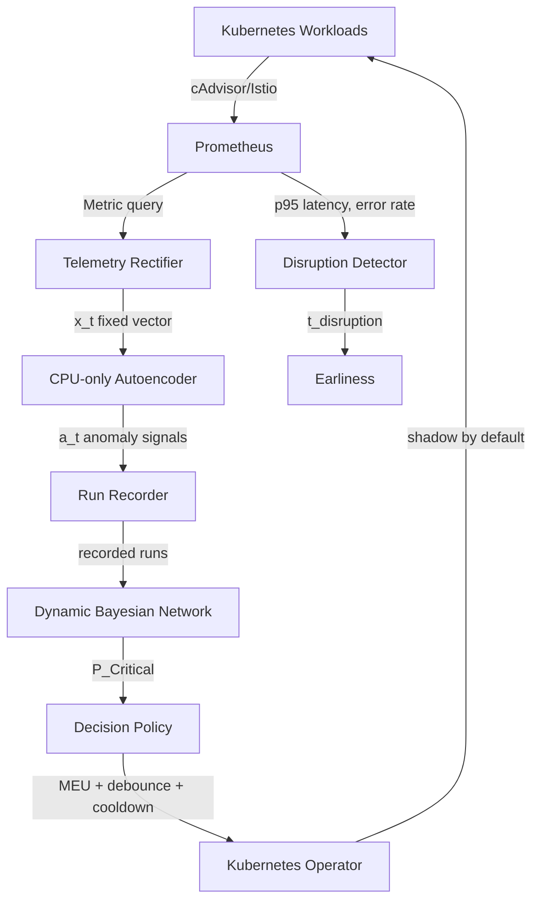

# PREFACE-DBN: Proactive Kubernetes Failure Prediction and Autonomous Mitigation

## PROBLEM
Microservices suffer from complex cascading failures. Traditional monitoring reacts to failures *after* they occur. The original PREFACE research proposed using an Autoencoder to detect anomalies early (the "error interval") before they become disruptive failures. However, PREFACE lacked temporal reasoning (how failures propagate over time) and possessed no automated mitigation capability, merely triggering static alarms.

PREFACE-DBN extends this by introducing a **Dynamic Bayesian Network (DBN)** to track fault propagation across the service graph over time, and a **Maximum Expected Utility (MEU) Kubernetes Operator** to proactively and safely intervene before end-user disruption.

## ARCHITECTURE


## KEY CONTRIBUTIONS
1. **Bayesian State Estimation**: Replaced memoryless static thresholds with a Dynamic Bayesian Network tracking temporal failure probabilities via a particle filter.
2. **Directional Causal RCA**: Root-cause localization that uses the discovered service call graph rather than ranking anomaly magnitudes.
3. **Weakly-supervised calibration**: DBN emission, transition and topological parameters fitted from fault-injection ground truth (`src/weak_labels.py`).
4. **Measurable earliness**: Disruption detection using the source paper's criterion (Mann-Whitney U + Vargha-Delaney Â₁₂), so lead time before user impact is quantified rather than assumed.
5. **Safety architecture**: Two independent gates on live cluster mutation, temporal debounce, and per-root-cause cooldowns.

## IMPLEMENTED GOALS
1. **Goal 1**: Base PREFACE Autoencoder metrics, detecting faults prior to system crash.
2. **Goal 2**: DBN inference engine mapped to the microservice topology.
3. **Goal 3**: Directional causality, to distinguish causal origin from downstream victims.
4. **Goal 4**: Multi-signal telemetry, fusing CPU, memory, request rate, error rate and Istio edge metrics into Bayesian evidence.
5. **Goal 5**: Automated parameter calibration (EM) replacing hardcoded assumptions.
6. **Goal 6**: Partitioned evaluation over healthy and faulty trials.

## ⚠️ CURRENT STATUS OF RESULTS

**The system is built. It has not yet been validated on live telemetry.**

Earlier versions of this README reported *100% Precision, 100% Recall, 100% F1, 0% FPR*. Those numbers came from `36_evaluate_goal6.py` generating its own signals with `np.random.normal` — healthy at `0.1 ± 0.1`, faulty at `5.0 ± 0.5`. Those classes sit roughly ten standard deviations apart, so **any threshold between 0.5 and 4.0 scores 100%**. The result measured the data generator, not the system.

Likewise, Goal 5's calibration fitted EM to sequences sampled from a hand-written ground truth (`true_mu = [0.1, 3.0, 5.5]`), recovering the parameters of its own generator. That is a valid *unit test of the estimator* — and is retained as one — but it is not calibration from telemetry.

The evaluation pipeline has since been restructured so this cannot happen silently:

- Data collection and scoring are separate processes (`37_record_runs.py` → `36_evaluate_goal6.py`).
- Every recorded run is stamped `source: live | synthetic`. Results from synthetic runs print an explicit **"SMOKE TEST, NOT A SYSTEM EVALUATION"** banner regardless of which flag was used.
- A single result set may not mix live and synthetic runs.

**Live-telemetry numbers are pending a cluster.** Until then this repository contains a validated pipeline and no system results.

## TECH STACK
- **Orchestration**: Kubernetes (kind), Chaos Mesh, Istio
- **Telemetry**: Prometheus, cAdvisor
- **Machine Learning**: PyTorch (autoencoder); the DBN is a hand-written vectorised particle filter over NumPy (`src/ddn_core_phase3.py`) — `pgmpy` is *not* used
- **Statistics**: SciPy (Mann-Whitney U), NumPy
- **Control Plane**: Kopf (`src/operator.py`)

## WORKFLOW

```bash
# 1. Infrastructure
./scripts/01_setup_local_cluster.ps1
./scripts/03_deploy_telemetry.sh
python scripts/26_discover_service_graph.py     # real topology from Istio

# 2. Check readiness without touching anything
python scripts/37_record_runs.py --mode live --dry-run

# 3. Record runs (60s ticks, Chaos Mesh injection)
python scripts/37_record_runs.py --mode live --healthy-runs 6 --faulty-runs 6

# 4. Calibrate the DBN from those runs
python scripts/38_calibrate_from_runs.py --dir data/experiments/runs \
    --out data/experiments/params/live.json

# 5. Evaluate
python scripts/36_evaluate_goal6.py --source recorded \
    --dir data/experiments/runs --params data/experiments/params/live.json

# 6. Head-to-head against the original PREFACE reasoner on identical data
python scripts/39_compare_baseline.py --dir data/experiments/runs \
    --params data/experiments/params/live.json
```

No cluster? `--mode synthetic` exercises the whole pipeline offline, with results clearly marked as non-evidence.

## METRICS

Defined as in the source paper so numbers are comparable:

| Metric | Meaning |
|---|---|
| **Reaction interval** | Fault injection → first correct prediction |
| **Earliness interval** | First correct prediction → user-visible disruption |
| **Root cause accuracy** | Fraction of detected faults localized to the injected service |
| **False positive rate** | Alarms raised during strictly healthy runs |

**Disruption** is the first tick where p95 latency or HTTP error rate is both statistically significantly worse than the healthy baseline (Mann-Whitney U) *and* substantially so (Vargha-Delaney Â₁₂ ≥ 0.71), sustained for 3 consecutive ticks with Bonferroni correction across candidate ticks. The persistence and correction requirements are not decoration: without them the detector fires on **38.5%** of purely healthy runs, because the criterion is re-tested every tick. With them that drops to **0.5%** while real disruptions are still caught 100% of the time.

## SAFETY DESIGN

Live cluster mutation requires **two independent gates**:

1. `ActionExecutor(allow_live=True)` — set via `PREFACE_ALLOW_LIVE=true` in the operator's environment
2. `spec.policy.shadowMode: false` on the FailurePredictor resource

Neither alone is sufficient, so no single flag flip or config default can cause a real mutation. Shadow mode is also the default whenever the field is absent.

Additionally:
- **Temporal debounce** — N consecutive critical ticks before an action is eligible
- **Per-root-cause cooldowns** — prevents repeated intervention on the same service
- **Honest results** — unimplemented actions return `NOT_IMPLEMENTED` rather than logging a command and claiming success. Live implementations exist for `Restart_Pod` and `Scale_Out`.

## KNOWN GAPS

- **No live-telemetry results yet** — the pipeline is validated; the experiment is not run.
- **CPU-only features.** The Rectifier consumes one KPI. Network-delay faults are largely invisible to CPU metrics, so the paper's weakest class remains untested.
- **`node_cpu` is a placeholder.** `03_deploy_telemetry.sh` disables node-exporter, so node-level features carry a constant.
- **Root-cause accuracy is topology-sensitive.** On a flat star topology it scores near chance; on the discovered graph (depth 3) it scores far higher. Measured on synthetic signals only — this needs confirming on real data.
- **Reschedule and traffic-shift** have no live implementation.

## REPRODUCTION NOTES

`data/experiments/` and `models/` are gitignored, so recorded runs and trained models are not in the repository. Regenerate them with the workflow above.
