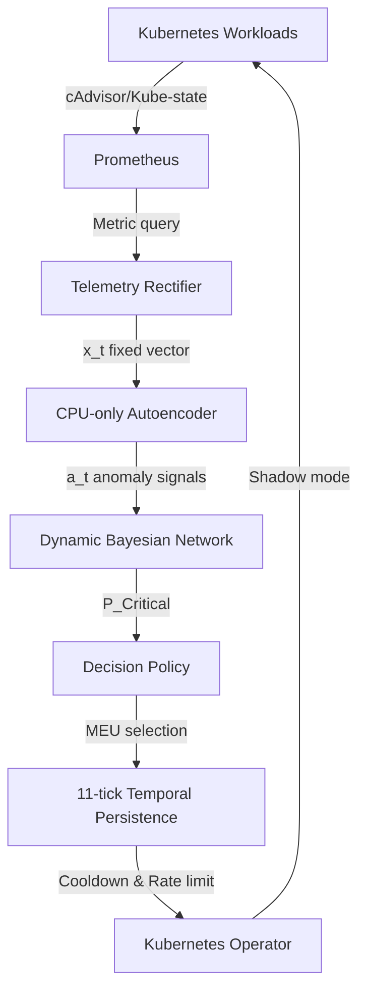

# PREFACE-DBN: Proactive Kubernetes Failure Prediction and Autonomous Mitigation

## PROBLEM
Microservices suffer from complex cascading failures. Traditional monitoring reacts to failures *after* they occur. The original PREFACE research proposed using an Autoencoder to detect anomalies early (the "error interval") before they become disruptive failures. However, PREFACE lacked temporal reasoning (how failures propagate over time) and possessed no automated mitigation capability, merely triggering static alarms.

PREFACE-DBN extends this by introducing a **Dynamic Bayesian Network (DBN)** to track fault propagation across the service graph over time, and a **Maximum Expected Utility (MEU) Kubernetes Operator** to proactively and safely intervene before end-user disruption.

## ARCHITECTURE


## KEY CONTRIBUTIONS
1. **Bayesian State Estimation**: Replaced memoryless static thresholds with a Dynamic Bayesian Network tracking temporal failure probabilities.
2. **Robust Inference**: Resolved numerical instability in Autoencoder latent spaces using robust statistics (Median/IQR).
3. **Autonomous Mitigation**: Built an MEU-driven Kubernetes Operator capable of selecting the mathematically optimal intervention (Reschedule vs Restart).
4. **Safety Architecture**: Implemented an 11-tick temporal debounce, 300-second cooldowns, and a strict Shadow Mode to prevent catastrophic automation thrashing.

## TECH STACK
- **Orchestration**: Kubernetes, Chaos Mesh
- **Telemetry**: Prometheus, cAdvisor
- **Machine Learning**: PyTorch (Autoencoder), pgmpy (DBN), Pandas, Polars
- **Control Plane**: Kopf (Python Kubernetes Operator)

## EXPERIMENTAL RESULTS

### 🟩 IMPLEMENTED
- Kubernetes cluster telemetry extraction & Rectifier feature engineering.
- Robust CPU-only Autoencoder training on healthy TrainTicket baselines.
- DBN temporal reasoning engine mapped to TrainTicket topology.
- Kubernetes Custom Resource (FailurePredictor) and Kopf Operator.
- MEU Decision Policy with safety rails (Debounce, Cooldown, Rate limiting).

### 🟦 EXPERIMENTALLY VALIDATED
- **CPU Stress Faults (Single)**: Safely detects and localizes single-service CPU anomalies within the pre-disruption earliness interval.
- **Safety Rails**: Shadow mode successfully prevents physical cluster mutation while tracking hypothetical interventions. Cooldowns correctly prevent mitigation thrashing.
- **Temporal Persistence**: Successfully suppresses transient noise via the 11-tick debounce.

### 🟨 NOT YET VALIDATED
- **Network-Delay Faults**: Theoretical superiority of the DBN over the baseline for low-signal network faults remains experimentally unproven.
- **Risk Calibration**: Statistical confidence in `P(Critical) = 0.95` translates strictly to 95% certainty across large datasets.
- **Memory Faults**: No safe, reproducible memory stress injector is currently available.

## BASELINE COMPARISON
In a rigorous head-to-head backtest of a single-service CPU fault (`pilot_cpu_01`):
* **The Baseline Won**: The original PREFACE memoryless `m_e + 3s_e` threshold detected and localized the fault instantly (0.0s).
* **The DBN Trade-off**: PREFACE-DBN correctly modeled the fault, but its strict safety layer (the 11-tick temporal persistence) delayed intervention by 56 seconds. During this delay, the fault propagated backpressure to a proxy node. The DBN was tricked into blaming the proxy, triggering a 300-second cooldown lockout on the wrong service.
* **Conclusion**: Temporal filtering prevents thrashing but allows fast-acting faults to propagate and confuse the reasoner.

## SAFETY DESIGN
To prevent "mitigation-induced incidents", PREFACE-DBN enforces:
1. **Shadow Mode**: Shadow mode is enabled by default and live Kubernetes mutation is currently blocked at the ActionExecutor safety boundary. No real Kubernetes API destructive actions are executed.
2. **Temporal Debounce**: 11 consecutive critical ticks (approx 55 seconds) are required before any action is eligible.
3. **Cooldowns**: A 300-second per-root-cause cooldown prevents rapid, repeated interventions.

## LIMITATIONS
- **Sample Size**: Conclusions are drawn from a limited pilot fault run. Broad multi-run superiority is not yet established.
- **Unavailable Fault Classes**: Memory leak experiments were abandoned due to the lack of safe, isolated Kubernetes memory injectors.
- **Proxy Blame**: The DBN currently struggles to distinguish between causal origin nodes and downstream proxy nodes experiencing backpressure.

## REPRODUCTION
**Start Infrastructure**:
```bash
# Setup kind cluster and prometheus
./scripts/01_setup_local_cluster.ps1
```
**Run Inference / Evaluation**:
```bash
# Run the Phase 5 benchmark comparison
python scripts/33_compare_preface_vs_dbn.py

# Compute metrics
python scripts/32_compute_phase5_metrics.py
```
*(Warning: Do not modify `shadow_mode` in the DecisionPolicy unless operating on a disposable cluster.)*

## PROJECT STATUS
**Sprint 5.4 Complete.** The core research implementation is finalized and frozen. The system successfully demonstrates the theoretical architecture of utility-driven DBN mitigation, while experimental evidence highlights crucial trade-offs between instantaneous heuristics and temporal safety filtering.
