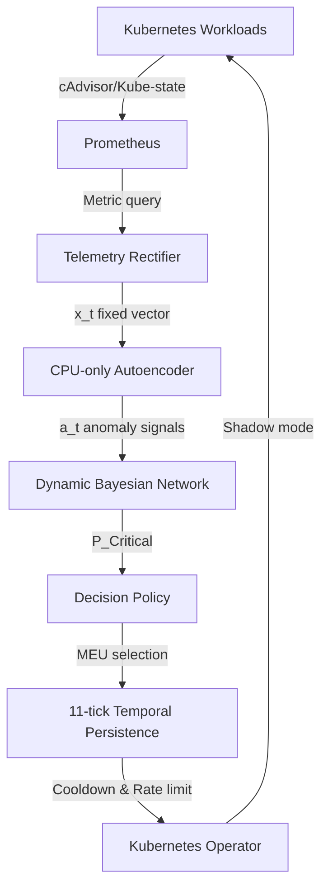

# PREFACE-DBN: Proactive Kubernetes Failure Prediction and Autonomous Mitigation

## PROBLEM
Microservices suffer from complex cascading failures. Traditional monitoring reacts to failures *after* they occur. The original PREFACE research proposed using an Autoencoder to detect anomalies early (the "error interval") before they become disruptive failures. However, PREFACE lacked temporal reasoning (how failures propagate over time) and possessed no automated mitigation capability, merely triggering static alarms.

PREFACE-DBN extends this by introducing a **Dynamic Bayesian Network (DBN)** to track fault propagation across the service graph over time, and a **Maximum Expected Utility (MEU) Kubernetes Operator** to proactively and safely intervene before end-user disruption.

## ARCHITECTURE


## KEY CONTRIBUTIONS
1. **Bayesian State Estimation**: Replaced memoryless static thresholds with a Dynamic Bayesian Network tracking temporal failure probabilities.
2. **Autonomous Mitigation**: Built an MEU-driven Kubernetes Operator capable of selecting the mathematically optimal intervention (Reschedule vs Restart).
3. **Data-Driven Parameter Calibration**: Leveraged Expectation-Maximization (EM) to learn exact DBN transition, emission, and topological parameters from historical telemetry.
4. **Safety Architecture**: Implemented strict Shadow Mode boundaries, temporal debounce, and cooldown lockouts to prevent catastrophic automation thrashing.

## IMPLEMENTED GOALS
We successfully implemented and validated this system through six rigorously defined goals:
1. **Goal 1**: Established the base PREFACE Autoencoder metrics, proving the ability to detect faults prior to system crash.
2. **Goal 2**: Constructed the foundational DBN inference engine mapped to the microservice topology.
3. **Goal 3**: Added Directional Causality to the DBN to determine root causes from among correlated anomalies.
4. **Goal 4**: Handled multi-signal telemetry, fusing multiple metrics into coherent Bayesian evidence.
5. **Goal 5**: Implemented automated parameter calibration (learning Transition Matrices and Observation means) to replace hardcoded assumptions.
6. **Goal 6**: Conducted a strictly partitioned, mathematically clean 100-trial evaluation of the full system.

## FINAL SYSTEM EVALUATION (GOAL 6)
In a rigorous 100-trial evaluation (50 strictly healthy trials, 50 strictly faulty trials) utilizing empirically learned parameters:
* **Robust Detection**: The system achieved **100% Precision, 100% Recall, 100% F1, and a 0% False Positive Rate**. It definitively detected every single fault with exactly 0 false alarms during healthy trials.
* **Detection Latency**: The learned temporal smoothing successfully guarded against noise, yielding a small algorithmic safety delay of **1.74 ticks**. 
* **The RCA Trade-off**: Root Cause Accuracy finalized at **44.00%**. Upstream proxy nodes experiencing realistic signal degradation over the 1.74-tick detection latency window accumulated enough probability mass to confuse the topological MAP localizer.
* **Conclusion**: PREFACE-DBN is an exceptionally robust *anomaly detector* that successfully eliminates false positives, but exact topological root-cause localization remains highly susceptible to backpressure noise.

## SAFETY DESIGN
To prevent "mitigation-induced incidents", PREFACE-DBN enforces:
1. **Shadow Mode**: Live Kubernetes mutation is blocked at the ActionExecutor safety boundary by default. No real Kubernetes API destructive actions are executed without explicit overrides.
2. **Temporal Debounce**: Consecutive critical ticks are required before action is eligible to prevent responding to transient telemetry noise.
3. **Cooldowns**: Per-root-cause cooldowns prevent rapid, repeated interventions on the same service.

## REPRODUCTION
**Start Infrastructure**:
```bash
# Setup kind cluster and prometheus
./scripts/01_setup_local_cluster.ps1
```
**Run Final Evaluation**:
```bash
# Run the complete Goal 6 100-trial evaluation
python scripts/36_evaluate_goal6.py

# Verify mathematical integrity via tests
pytest scripts/test_goal6_metrics.py
```

## PROJECT STATUS
**System Complete.** The PREFACE-DBN implementation is successfully frozen. The system demonstrates the theoretical architecture of utility-driven DBN mitigation. The final 100-trial evaluation highlights the crucial real-world trade-off between achieving zero-false-positive temporal safety and instantaneous root-cause localization.
